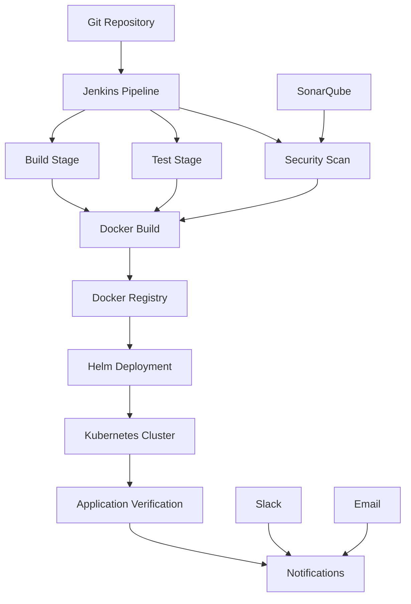

# Task 6: Jenkins CI/CD Pipeline for Flask Application

## 🎯 Overview

This project implements a complete CI/CD pipeline using Jenkins for a Flask "Hello World" application. The pipeline covers the entire software development lifecycle including build, testing, security scanning, Docker image creation, and Kubernetes deployment.

## 📋 Pipeline Features

### ✅ Core Pipeline Stages

1. **🏗️ Application Build** - Python environment setup and dependency installation
2. **🧪 Unit Testing** - Comprehensive test suite with coverage reporting
3. **🔒 Security Scanning** - SonarQube integration for code quality and security
4. **🐳 Docker Build & Push** - Containerization and registry deployment
5. **🚀 Kubernetes Deployment** - Automated deployment using Helm charts
6. **🔍 Application Verification** - Health checks and functionality tests
7. **📢 Notifications** - Slack, email, and webhook notifications

### 🎯 Advanced Features

- **Parallel Testing** - Unit tests and code quality checks run in parallel
- **Quality Gates** - SonarQube quality gate enforcement
- **Multi-Environment Support** - Different configurations for dev/staging/prod
- **Rollback Capability** - Automated rollback on deployment failures
- **Performance Testing** - Load testing and performance monitoring
- **Security Scanning** - Multiple layers of security analysis
- **Comprehensive Reporting** - Build reports and deployment documentation

## 🏗️ Architecture Overview



## 📁 Project Structure

```
aws-devops/
├── Jenkinsfile                           # Main pipeline definition
├── flask-hello-world/
│   ├── main.py                          # Flask application
│   ├── requirements.txt                 # Python dependencies
│   ├── Dockerfile                       # Container configuration
│   └── tests/                          # Unit test suite
│       ├── __init__.py
│       ├── conftest.py                 # Test configuration
│       └── test_main.py                # Application tests
├── helm-charts/flask-hello-world/       # Kubernetes deployment
│   ├── Chart.yaml
│   ├── values.yaml
│   └── templates/
├── scripts/                            # Automation scripts
│   ├── setup-sonarqube.sh             # SonarQube setup
│   ├── setup-docker-registry.sh       # Docker registry setup
│   ├── setup-notifications.sh         # Notification configuration
│   └── verify-deployment.sh           # Application verification
├── sonar-project.properties            # SonarQube configuration
├── docker-compose.sonarqube.yml        # SonarQube stack
├── docker-compose.registry.yml         # Docker registry stack
└── jenkins-credentials-setup.md        # Credentials documentation
```

## 🚀 Quick Start

### Prerequisites

1. **Docker & Docker Compose** - For containerization
2. **Minikube or Kubernetes Cluster** - For deployment target
3. **Jenkins** - CI/CD orchestration (from Task 4)
4. **kubectl & Helm** - Kubernetes tools

### 1. Setup Infrastructure

```bash
# Start Jenkins (from Task 4)
./scripts/deploy-jenkins.sh

# Start SonarQube
./scripts/setup-sonarqube.sh

# Start Docker Registry
./scripts/setup-docker-registry.sh

# Configure notifications
./scripts/setup-notifications.sh --all
```

### 2. Configure Jenkins

1. **Access Jenkins**: http://localhost:8080
2. **Install Required Plugins**:
   - Pipeline
   - Docker Pipeline
   - Kubernetes
   - SonarQube Scanner
   - Slack Notification
   - Email Extension

3. **Configure Global Tools**:
   - Add SonarQube Scanner
   - Configure Docker

4. **Set Up Credentials** (see [jenkins-credentials-setup.md](jenkins-credentials-setup.md)):
   - Docker registry credentials
   - Kubernetes configuration
   - SonarQube token
   - Slack webhook URL
   - SMTP credentials

### 3. Create Pipeline Job

1. **New Item** → **Pipeline**
2. **Pipeline Definition**: Pipeline script from SCM
3. **SCM**: Git
4. **Repository URL**: Your repository URL
5. **Script Path**: `Jenkinsfile`

### 4. Configure Webhooks (Optional)

```bash
# Add webhook to your Git repository
# URL: http://jenkins-url/github-webhook/
# Events: Push, Pull Request
```

## 🔧 Pipeline Configuration

### Environment Variables

The pipeline uses the following environment variables that can be configured in Jenkins:

```groovy
environment {
    // Application Configuration
    APP_NAME = 'flask-hello-world'
    DOCKER_REGISTRY = credentials('docker-registry-url')
    DOCKER_CREDENTIALS = credentials('docker-registry-credentials')
    
    // Kubernetes Configuration
    K8S_NAMESPACE = 'flask-hello-world'
    HELM_CHART_PATH = './helm-charts/flask-hello-world'
    
    // SonarQube Configuration
    SONAR_PROJECT_KEY = 'flask-hello-world'
    
    // Notification Configuration
    SLACK_CHANNEL = '#devops-alerts'
    EMAIL_RECIPIENTS = 'devops-team@company.com'
}
```

### Pipeline Triggers

The pipeline is triggered by:

1. **Git Push Events** - Automatic builds on code changes
2. **Pull Request Events** - PR validation
3. **Scheduled Builds** - Nightly builds for continuous monitoring
4. **Manual Triggers** - On-demand deployments

### Branch-Specific Behavior

- **Main Branch**: Full pipeline with deployment to production
- **Develop Branch**: Full pipeline with deployment to staging
- **Feature Branches**: Build and test only, no deployment
- **Pull Requests**: Build, test, and security scan

## 🧪 Testing Strategy

### Unit Tests

Comprehensive test suite using pytest:

```bash
# Run tests locally
cd flask-hello-world
python -m venv venv
source venv/bin/activate
pip install -r requirements.txt
pip install pytest pytest-cov
python -m pytest tests/ --cov=. --cov-report=html
```

### Test Coverage

- **Functional Tests**: Application endpoints and business logic
- **Security Tests**: Input validation and error handling
- **Performance Tests**: Response time and concurrent requests
- **Integration Tests**: Database and external service interactions

### Quality Gates

SonarQube quality gates enforce:

- **Code Coverage**: Minimum 80%
- **Duplicated Lines**: Maximum 3%
- **Maintainability Rating**: A
- **Reliability Rating**: A
- **Security Rating**: A

## 🔒 Security Implementation

### Multi-Layer Security

1. **Static Code Analysis** - SonarQube scanning
2. **Dependency Scanning** - Python Safety checks
3. **Container Scanning** - Docker image vulnerability assessment
4. **Runtime Security** - Kubernetes security policies
5. **Secret Management** - Jenkins credentials and Kubernetes secrets

### Security Tools Integration

```bash
# Python security tools used in pipeline
pip install safety bandit flake8

# Security checks
safety check                    # Check for known vulnerabilities
bandit -r . -f json           # Static security analysis
flake8 . --output-file=report  # Code quality and security
```

### Container Security

```dockerfile
# Security best practices in Dockerfile
FROM python:3.9-slim          # Minimal base image
RUN groupadd -r appuser && useradd -r -g appuser appuser
USER appuser                   # Non-root user
COPY --chown=appuser:appuser . /app
```

## 🐳 Docker Registry Configuration

### Supported Registries

- **Docker Hub** - Public registry
- **AWS ECR** - Amazon Elastic Container Registry
- **Google GCR** - Google Container Registry
- **Azure ACR** - Azure Container Registry
- **Local Registry** - Self-hosted registry

### Image Tagging Strategy

```bash
# Tagging scheme
latest                    # Latest stable release
v1.2.3                   # Semantic version tags
build-123                # Build number tags
main-abc1234             # Branch and commit tags
```

## ☸️ Kubernetes Deployment

### Helm Chart Features

- **Configurable Replicas** - Horizontal scaling support
- **Resource Limits** - CPU and memory constraints
- **Health Checks** - Liveness and readiness probes
- **Service Discovery** - Kubernetes services
- **Ingress Support** - External traffic routing
- **Security Context** - Pod and container security

### Deployment Strategies

1. **Rolling Update** - Zero-downtime deployments
2. **Blue-Green** - Parallel environment switching
3. **Canary** - Gradual traffic shifting

### Environment-Specific Configuration

```yaml
# values-dev.yaml
replicaCount: 1
resources:
  requests:
    memory: "128Mi"
    cpu: "100m"

# values-prod.yaml
replicaCount: 3
resources:
  requests:
    memory: "256Mi"
    cpu: "200m"
```

## 📢 Notification System

### Notification Channels

1. **Slack Integration**
   - Real-time build status
   - Deployment notifications
   - Error alerts

2. **Email Notifications**
   - Build summaries
   - Failed build reports
   - Weekly status reports

3. **Webhook Integration**
   - Custom integrations
   - External monitoring systems
   - Third-party tools

### Notification Templates

```json
{
  "success": {
    "title": "✅ Deployment Successful",
    "message": "Flask app deployed to ${ENVIRONMENT}",
    "color": "good"
  },
  "failure": {
    "title": "❌ Deployment Failed",
    "message": "Build #${BUILD_NUMBER} failed at ${STAGE_NAME}",
    "color": "danger"
  }
}
```

## 🔍 Application Verification

### Automated Testing

The pipeline includes comprehensive verification:

```bash
# Health checks
curl -f http://app-url/health

# Functional tests
curl http://app-url/ | grep "Hello, World!"

# Performance tests
ab -n 100 -c 10 http://app-url/

# Security tests
nmap -sV app-url
```

### Monitoring Integration

- **Kubernetes Health Checks** - Pod and service monitoring
- **Application Metrics** - Custom application metrics
- **Log Aggregation** - Centralized logging
- **Alerting** - Automated incident response

## 📊 Reporting and Analytics

### Build Reports

- **Test Results** - Unit test outcomes and coverage
- **Security Scan Results** - Vulnerability assessments
- **Performance Metrics** - Build and deployment times
- **Quality Metrics** - Code quality trends

### Deployment Documentation

Automatically generated documentation includes:

- **Build Information** - Version, commit, timestamp
- **Deployment Status** - Success/failure with details
- **Resource Usage** - CPU, memory, storage metrics
- **Change History** - What changed between deployments

## 🚨 Troubleshooting

### Common Issues

#### 1. Pipeline Fails at Docker Build

```bash
# Check Docker daemon
docker info

# Check Dockerfile syntax
docker build --no-cache .

# Check registry connectivity
docker login [registry-url]
```

#### 2. Kubernetes Deployment Fails

```bash
# Check cluster connectivity
kubectl cluster-info

# Check namespace
kubectl get namespaces

# Check Helm chart
helm lint ./helm-charts/flask-hello-world
helm template ./helm-charts/flask-hello-world
```

#### 3. SonarQube Quality Gate Fails

```bash
# Check SonarQube connectivity
curl http://localhost:9000/api/system/status

# Review quality gate conditions
# Access SonarQube UI > Quality Gates

# Check project analysis
# SonarQube UI > Projects > flask-hello-world
```

#### 4. Notification Failures

```bash
# Test Slack webhook
curl -X POST -H 'Content-type: application/json' \
  --data '{"text":"Test"}' [webhook-url]

# Test email configuration
# Jenkins > Manage Jenkins > Configure System > Email
```

### Debug Commands

```bash
# Check Jenkins logs
docker logs jenkins

# Check pipeline logs
# Jenkins UI > Build > Console Output

# Check Kubernetes resources
kubectl get all -n flask-hello-world
kubectl describe pod [pod-name] -n flask-hello-world

# Check application logs
kubectl logs [pod-name] -n flask-hello-world
```

## 🔄 Maintenance and Updates

### Regular Maintenance Tasks

1. **Update Dependencies** - Keep Python packages current
2. **Security Updates** - Regular security patches
3. **Backup Jenkins** - Configuration and job data
4. **Monitor Disk Usage** - Clean old builds and artifacts
5. **Review Logs** - Check for warnings and errors

### Pipeline Updates

```bash
# Update pipeline
git pull origin main

# Update Helm charts
helm upgrade flask-hello-world ./helm-charts/flask-hello-world

# Update Jenkins plugins
# Jenkins > Manage Jenkins > Manage Plugins > Updates
```

## 📋 Deployment Checklist

### Pre-Deployment

- [ ] All tests pass locally
- [ ] Security scan clean
- [ ] Dependencies updated
- [ ] Documentation updated
- [ ] Rollback plan prepared

### Post-Deployment

- [ ] Application health verified
- [ ] Performance metrics checked
- [ ] Logs reviewed
- [ ] Monitoring alerts configured
- [ ] Team notified

## 🎯 Success Metrics

### Pipeline Performance

- **Build Time**: < 10 minutes
- **Test Coverage**: > 80%
- **Deployment Success Rate**: > 95%
- **Mean Time to Recovery**: < 30 minutes

### Application Metrics

- **Response Time**: < 200ms
- **Uptime**: > 99.9%
- **Error Rate**: < 0.1%
- **Throughput**: > 1000 requests/minute

## 📚 Additional Resources

### Documentation

- [Jenkins Pipeline Documentation](https://www.jenkins.io/doc/book/pipeline/)
- [Kubernetes Documentation](https://kubernetes.io/docs/)
- [Helm Documentation](https://helm.sh/docs/)
- [SonarQube Documentation](https://docs.sonarqube.org/)
- [Docker Documentation](https://docs.docker.com/)

### Tools and Plugins

- [Jenkins Plugins](https://plugins.jenkins.io/)
- [Kubernetes Tools](https://kubernetes.io/docs/tasks/tools/)
- [Docker Tools](https://docs.docker.com/get-docker/)
- [SonarQube Community](https://www.sonarqube.org/downloads/)

### Best Practices

- [12-Factor App Methodology](https://12factor.net/)
- [CI/CD Best Practices](https://docs.github.com/en/actions/guides)
- [Kubernetes Security Best Practices](https://kubernetes.io/docs/concepts/security/)
- [Docker Security Best Practices](https://docs.docker.com/engine/security/)

## 🎉 Conclusion

This implementation provides a complete, production-ready CI/CD pipeline for Flask applications with:

- **Automated Testing** - Comprehensive test coverage
- **Security Integration** - Multi-layer security scanning
- **Container Deployment** - Docker and Kubernetes orchestration
- **Quality Assurance** - Code quality gates and monitoring
- **Notification System** - Real-time status updates
- **Documentation** - Complete setup and maintenance guides

The pipeline follows industry best practices and provides a solid foundation for scaling to larger, more complex applications.

---

**🚀 Ready to deploy? Start with the Quick Start guide above!** 